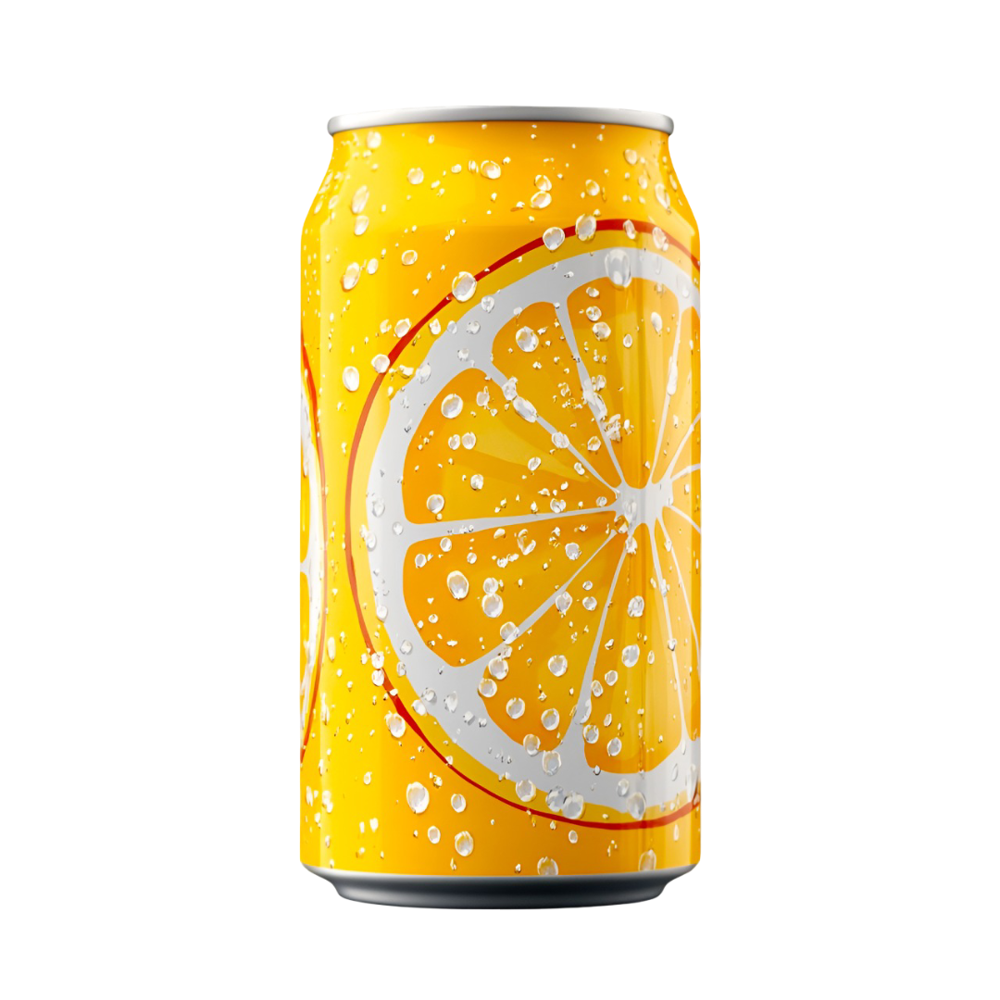
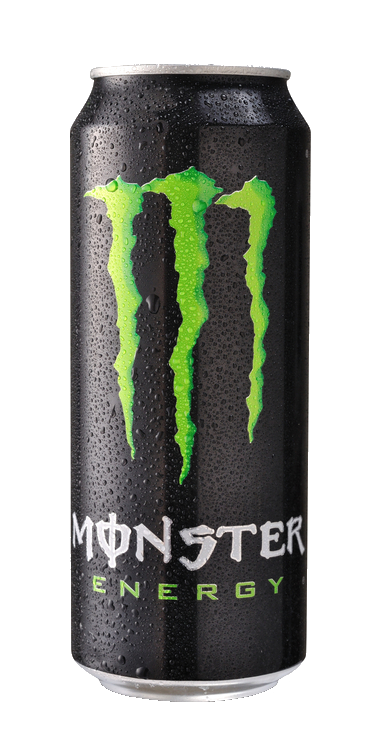
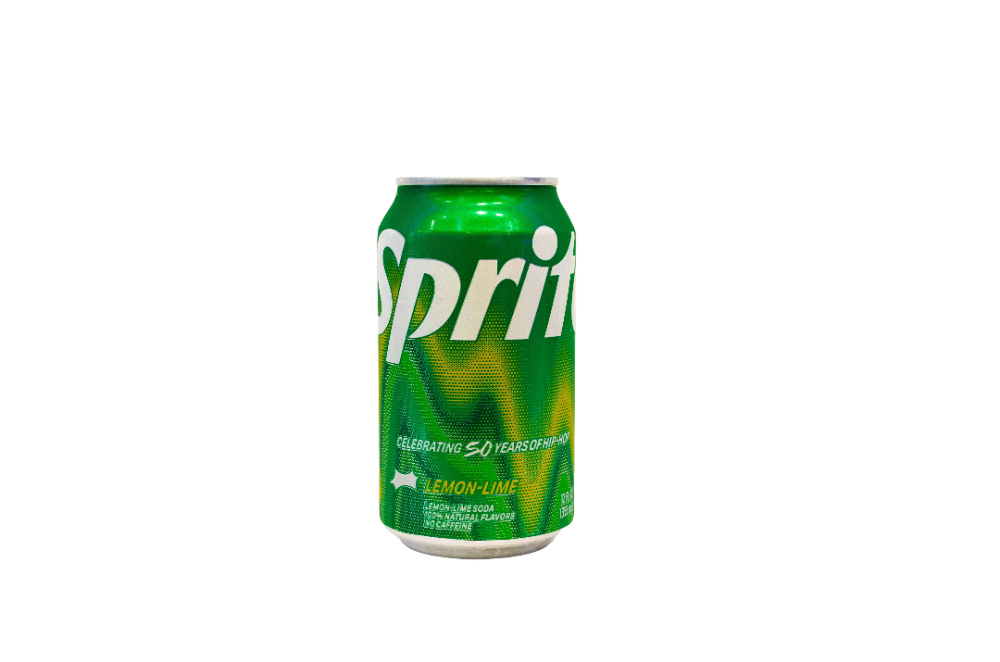

# 🧃 ZestRush-by-Manav

**ZestRush** is a bold and energetic landing page concept for a modern beverage brand. Designed to feel as refreshing as the drinks it promotes, the site combines smooth animations, stylish transitions, and a youthful vibe to make a lasting first impression.

---

## 🚀 Live Demo

> This is a design prototype only — not a fully functional product website.  
> Click the buttons to explore the concept (some may trigger alerts to simulate action).

---

## ✨ Features

- 🔁 **Dynamic image transitions** (Desktop & Mobile friendly)
- 🎨 **Color-changing background** with circular transitions
- 🖱️ **AOS (Animate on Scroll)** animations for smooth entry
- 📱 **Responsive layout** adapting seamlessly to all screen sizes
- ⚡ **Clean & bold typography** powered by Google Fonts
- 🎉 **Cool vibe** & energetic messaging tailored for Gen Z

---

## 💻 Tech Stack

| HTML | CSS | JavaScript |
|------|-----|------------|
| ✅   | ✅  | ✅         |

Also uses:
- [AOS Library](https://michalsnik.github.io/aos/) for scroll animations  
- [Font Awesome](https://fontawesome.com/) for icons  
- Google Fonts (`Poppins`) for modern font styling

---

## 📸 Screenshots

### 💡 Hero Section

### 🔁 Image Transitions
| Chai | Matcha | Juice | Cold Drink | Coca |
|------|--------|-------|-------------|------|
|  |  |  |  |  |

### 🎨 Background Themes
| Monster | Sprite | Smoothy |
|---------|--------|---------|
|  |  |  |

---

## 📁 Project Structure

ZestRush/
├── index.html
├── style.css
├── README.md
└── images/
├── chai.png
├── coca.png
├── coffe.png
├── cold drink.png
├── juice.png
├── logo.png
├── matcha.png
├── monster.png
├── smoothy.png
└── sprite.png

yaml
Copy
Edit

---

## 👤 About Me

Hey! I'm **[Manav Singh](https://github.com/Manav-0n-Site)** — a 12th-grade student and passionate front-end explorer.  
This project is a fun fusion of design, animation, and energy, made to practice visual storytelling through code.

---

## 📬 Feedback

Found something cool? Want to suggest improvements?  
Open an issue or drop a ⭐ on the repo — I'd love to hear from you!

---

## ⭐ Show Your Support

If you liked this concept, please:

- ⭐ Star this repository
- 🔁 Fork it
- 👣 Follow me on [GitHub](https://github.com/Manav-0n-Site)

---
